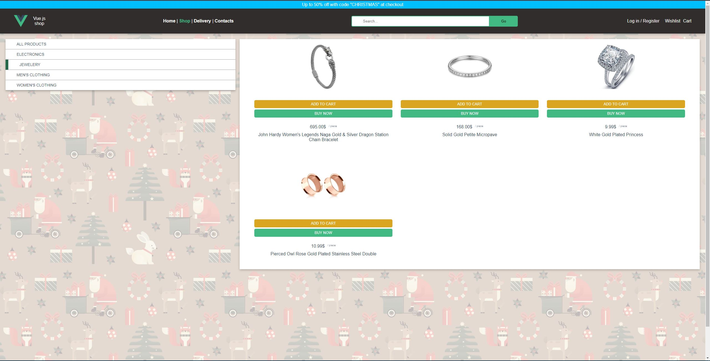

## Vue.js shop

### Simple shop with Vue.js

- There is no content outside shop category
- Shop data is from https://fakestoreapi.com/ using HTTP requests
- Shop data can be filtered by category or user input
- Nothing fancy, nothing special, just a demonstration on how to receive data from server and output in browser

